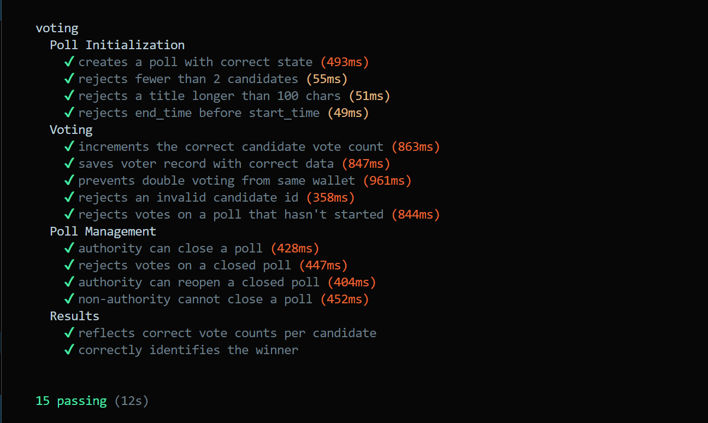

# Solana Voting dApp

A decentralized voting application built on Solana using the Anchor framework. Polls and votes are stored fully on-chain, and the PDA based voter record prevents any wallet from voting twice.

---

## Deployment (Devnet)

- **Program ID:** `9fRWQFyfPvsnrTNo6oYP3aZnu1rf13Wj4nb5qqc1o5YP`
- **Network:** `Devnet`
- **Transaction Signature:** `4JsJBumvibU6yscdbqNNSLoFXB334mupLrbyqGKLd57CWDYbi23US3RzPzpiK9u1dk2MT3u1rGzBUnyc4quVX2Qz`

View on Explorer: https://solscan.io/tx/4JsJBumvibU6yscdbqNNSLoFXB334mupLrbyqGKLd57CWDYbi23US3RzPzpiK9u1dk2MT3u1rGzBUnyc4quVX2Qz?cluster=devnet

## Test Results:



## Features

| Feature | Details |
|---|---|
| Create polls | Title, Description, Start/end timestamps |
| Cast votes | One vote per wallet per poll (enforced by PDA seeds) |
| Close / Reopen polls | Authority-only admin actions |
| Read results | Any client can fetch live vote counts and determine winner |
| Error handling | Custom error codes with descriptive messages |

---

## Program Architecture

```
programs/
└── voting_dapp/
    └── src/
        └── lib.rs        // All instructions, accounts & errors
tests/
└── voting_dapp.ts        // Full TypeScript test suite (Mocha/Chai)
```


### Instructions

| Instruction | Who | Description |
|---|---|---|
| `initialize_poll` | anyone | Creates a new poll |
| `cast_vote` | any wallet | Casts a vote; creates VoterRecord |
| `close_poll` | authority | Sets `is_active = false` |
| `reopen_poll` | authority | Sets `is_active = true` (if not past end_time) |

---

## Prerequisites

- [Rust](https://rustup.rs/)
- [Solana CLI](https://docs.solana.com/cli/install-solana-cli-tools) ≥ 1.18
- [Anchor CLI](https://www.anchor-lang.com/docs/installation) ≥ 0.29
- [Node.js](https://nodejs.org/) ≥ 18 & `yarn` / `npm`

---

## Getting Started

```bash
# 1. Clone the repo
git clone https://github.com/abwajidjamali/solana-voting-dapp.git
cd solana-voting-dapp

# 2. Install JS dependencies
yarn install

# 3. Generate a local Solana keypair (if you don't have one)
solana-keygen new

# 4. Set cluster to localnet
solana config set --url localhost

# 5. Start a local validator in a separate terminal
solana-test-validator

# 6. Build the program
anchor build

# 7. Sync the program ID (first time only)
anchor keys sync

# 8. Run tests
anchor test                          # spins up its own validator
```

---

## Deployment Guide

```bash
# Switch to devnet
solana config set --url devnet

# Airdrop SOL for deployment fees
solana airdrop 2

# Build & deploy
anchor build
anchor deploy

# Run tests against devnet
anchor test --provider.cluster devnet
```

---

## Interacting from the CLI

After `anchor build` the IDL is at `target/idl/voting_dapp.json`. You can interact with the program using any Anchor client or the Solana CLI.

### Quick JS snippet (cast a vote)

```typescript
import * as anchor from "@coral-xyz/anchor";
import { BN } from "@coral-xyz/anchor";

const provider = anchor.AnchorProvider.env();
anchor.setProvider(provider);
const program = anchor.workspace.Voting;

const pollId = new BN(1);
const [poll] = PublicKey.findProgramAddressSync(
  [Buffer.from("poll"), provider.wallet.publicKey.toBuffer(), pollId.toArrayLike(Buffer, "le", 8)],
  program.programId
);
const [voterRecord] = PublicKey.findProgramAddressSync(
  [Buffer.from("voter"), provider.wallet.publicKey.toBuffer(), pollId.toArrayLike(Buffer, "le", 8)],
  program.programId
);

await program.methods.castVote(pollId, 0).accounts({ poll, voterRecord, voter: provider.wallet.publicKey, systemProgram: anchor.web3.SystemProgram.programId }).rpc();
```

---

## Error Reference

| Code | Message |
|---|---|
| `TitleTooLong` | Title must be ≤ 100 characters |
| `DescriptionTooLong` | Description must be ≤ 500 characters |
| `NotEnoughCandidates` | At least 2 candidates required |
| `TooManyCandidates` | Maximum 10 candidates |
| `PollNotActive` | Poll is closed |
| `PollNotStarted` | Poll hasn't started yet |
| `PollEnded` | Poll's end time has passed |
| `InvalidCandidate` | Candidate ID out of range |
| `Unauthorized` | Only the poll authority can do this |

---
